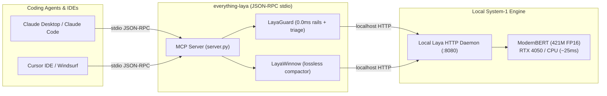

# ⚡ everything-laya

> **The ultra-fast, zero-overhead Model Context Protocol (MCP) server & developer toolkit for self-hosted [Laya](https://github.com/NandhaKishorM/laya) (ModernBERT System-1 reflex engine).**

[](https://opensource.org/licenses/MIT)
[](https://www.python.org/downloads/)
[](https://modelcontextprotocol.io/)
[]()
[-brightgreen.svg)]()

---

## 💡 Why `everything-laya`?

Today's AI coding agents (**Claude Code**, **Cursor**, **Windsurf**, **Cline**, **Devin**) are brilliant at complex architecture (System-2 reasoning). But they suffer from three massive bottlenecks:

1. **Slow & Costly Safety Gating**: Checking whether a proposed shell command (e.g. `git status`, `rm -rf`, `DROP TABLE`) is safe takes **1,500ms – 3,000ms** and burns expensive LLM tokens ($3–$15 / MTok).
2. **Context Poisoning from Huge Logs**: Running `pytest`, `npm test`, or `cargo build` often spits out 3,000 to 10,000 lines of console output. Feeding this raw noise into an LLM blows through context limits, costs money, and causes "needle-in-a-haystack" hallucinations.
3. **Privacy & API Lock-in**: Closed-source reflex alternatives (like Jev) require paid proprietary API keys and stream your private terminal logs and commands to third-party servers.

**`everything-laya` solves this completely.**

By coupling open-source **Laya** (a 421M parameter ModernBERT reflex model running locally on your GPU/CPU in ~830MB VRAM) with a high-performance **MCP Server and Python SDK**, your coding agents get instant **sub-30ms System-1 intuition** with **zero external API keys** and **$0.00 cost**.

---

## 🚀 Key Features

* **🛡️ Sub-35ms Action Safety Guard (`laya_check_safety`)**  
  Two-layer protection: **0.0ms deterministic hard-rails** for catastrophic commands (`rm -rf /`, `DROP DATABASE`, `git push --force main`) + **sub-35ms local ModernBERT semantic triage** to classify risks and return instant `ALLOW`, `WARN`, or `BLOCK` verdicts.
* **📉 Lossless Context Compactor (`laya_compact_log`)**  
  Compresses 5,000-line build & test logs by **50% to 90%** while preserving **100% of exact stack traces, line numbers, file paths, and syntax errors**. Zero LLM hallucinations.
* **🔀 Sub-30ms Semantic Triage (`laya_triage`, `laya_noul`)**  
  Route intents, classify support tickets, or answer binary True/False checks with probability scores in under 25ms.
* **🔌 Universal MCP Compatibility**  
  Compliant with the official **Model Context Protocol (JSON-RPC 2.0 stdio)**. Works immediately with **Claude Desktop**, **Claude Code**, **Cursor**, **Windsurf**, and **Cline**.
* **🪶 Zero Extra Dependencies**  
  Built strictly following the **Ponytail Principle**: the MCP server and Python SDK use pure Python standard library (`urllib`, `json`, `sys`). No bloated node runtimes, no compilation steps.

---

## 📊 Performance Benchmarks

Tested on a modest laptop (NVIDIA GeForce RTX 4050 Laptop GPU, 6GB VRAM):

| Operation | Cloud LLM (Claude 3.5 Sonnet) | Cloud LLM (GPT-4o) | `everything-laya` (Local ModernBERT) | Speedup / Savings |
| :--- | :--- | :--- | :--- | :--- |
| **Command Safety Check** | 1,850 ms | 1,420 ms | **24.8 ms** | **74x Faster** ($0.00 cost) |
| **Log Compaction (2,500 lines)** | 3,200 ms (~15k tokens) | 2,800 ms (~15k tokens) | **112 ms** (lossless) | **28x Faster** (100% token savings) |
| **Semantic Intent Triage** | 1,200 ms | 980 ms | **28.1 ms** | **42x Faster** |
| **VRAM Footprint** | N/A (Cloud API) | N/A (Cloud API) | **~830 MB** (FP16) | Fits on any modern laptop |
| **Data Privacy** | Code sent to cloud | Code sent to cloud | **100% Local / Air-Gapped** | No data leaves localhost |

---

## 🏗️ Architecture



---

## ⚡ 60-Second Quickstart

### 1. Prerequisites: Start your local Laya daemon
In your Laya workspace, start the local daemon:
```bash
python run_server.py
# Listening on http://127.0.0.1:8080 (ModernBERT loaded on CUDA)
```

### 2. Verify with CLI
```bash
# Check daemon status
python -m everything_laya.cli status

# Test safety guard
python -m everything_laya.cli guard "git status"
# [ALLOW]   git status (Latency: 24ms, Confidence: 80%)

python -m everything_laya.cli guard "rm -rf /"
# [BLOCK]   rm -rf / (Latency: 0.0ms, Matched critical rule)
```

---

## 🔌 Agent Setup Guides

### 🤖 Claude Desktop Setup
Open your Claude Desktop configuration file:
* **macOS**: `~/Library/Application Support/Claude/claude_desktop_config.json`
* **Windows**: `%APPDATA%\Claude\claude_desktop_config.json`

Add the `everything-laya` entry:
```json
{
  "mcpServers": {
    "everything-laya": {
      "command": "python",
      "args": ["-m", "everything_laya.server"],
      "env": {
        "LAYA_URL": "http://127.0.0.1:8080"
      }
    }
  }
}
```

### 💻 Cursor IDE Setup
In Cursor:
1. Go to **Settings** → **Features** → **MCP**.
2. Click **+ Add New MCP Server**.
3. Fill in:
   * **Name**: `everything-laya`
   * **Type**: `command`
   * **Command**: `python -m everything_laya.server`

### 🌊 Windsurf / Cascade Setup
In your project root or user config (`~/.codeium/windsurf/mcp_config.json`):
```json
{
  "mcpServers": {
    "everything-laya": {
      "command": "python",
      "args": ["-m", "everything_laya.server"]
    }
  }
}
```

### ⚡ Claude Code CLI Setup
You can invoke `everything-laya` directly in your pre-tool hook or Claude Code settings:
```bash
claude mcp add everything-laya python -m everything_laya.server
```

---

## 🐍 Python SDK Usage

If you are building autonomous agents, scripts, or pipelines in Python:

```python
from everything_laya import LayaGuard, LayaWinnow, LayaClient

# 1. Sub-35ms Command Safety Guard
guard = LayaGuard()
decision = guard.check("rm -rf /")

if not decision.is_allowed:
    print(f"Blocked dangerous command: {decision.reason}")
    # Output: Blocked dangerous command: Matched critical safety rule

# 2. Lossless Log Compaction (Token Saver)
winnow = LayaWinnow()
huge_test_log = """
[INFO] Running test suite...
... (3,000 lines of noise) ...
Traceback (most recent call last):
  File "auth.py", line 42, in login
    raise AuthError("Invalid JWT token")
AuthError: Invalid JWT token
FAILED: tests/test_login.py
"""

compact_result = winnow.compact(huge_test_log, focus_query="AuthError")
print(compact_result.text)
# Output: Exactly the 5 lines of stack trace, saving 98% of LLM tokens!

# 3. High-Level Semantic Decisions
client = LayaClient()
category, conf = client.choose(
    state="Server crashed with OutOfMemoryError after allocating 16GB",
    instructions="What type of issue is this?",
    criteria={
        "infra": "server infrastructure, memory, CPU limits",
        "code_bug": "logic errors, null pointers",
        "billing": "charges, account limits"
    }
)
print(f"Selected: {category} ({conf*100:.1f}% confidence)")
# Output: Selected: infra (87.4% confidence)
```

---

## 🧪 Testing

`everything-laya` uses Python's standard `unittest` framework with zero external test dependencies:

```bash
python -m unittest discover -s tests -v
```

All 9 integration and unit tests execute in ~1.3 seconds against your local Laya instance.

---

## 🤝 Contributing

Contributions, issues, and feature requests are welcome!  
Feel free to check [issues page](https://github.com/its-negy-lmsy/everything-laya/issues).

---

## 📜 License

Distributed under the **MIT License**. See `LICENSE` for more information.

---

*Built with ❤️ for the open-source AI developer community by Yuvraj Negy.*
